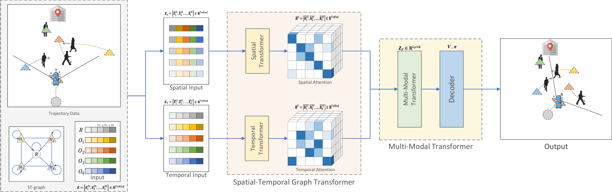

# NaviSTAR
**Official code** for IROS2023 paper "NaviSTAR: Socially Aware Robot Navigation with Hybrid Spatio-Temporal Graph Transformer and Preference Learning".

For information, please refer to [our website](https://sites.google.com/view/san-navistar).

## Abstract
Developing robotic technologies for use in human society requires ensuring the safety of robots' navigation behaviors while adhering to pedestrians' expectations and social norms. 
However, understanding complex human-robot interactions (HRI) to infer potential cooperation and response among robots and pedestrians for cooperative collision avoidance is challenging. 
To address these challenges, we propose a novel socially-aware navigation benchmark called NaviSTAR, which utilizes a hybrid Spatio-Temporal grAph tRansformer to understand interactions in human-rich environments fusing crowd multi-modal dynamic features. 
We leverage an off-policy reinforcement learning algorithm with preference learning to train a policy and a reward function network with supervisor guidance. Additionally, we design a social score function to evaluate the overall performance of social navigation. 
To compare, we train and test our algorithm with other state-of-the-art methods in both simulator and real-world scenarios independently. Our results show that NaviSTAR outperforms previous methods with outstanding performance.



## Requirement

### Environment

* OS: Ubuntu 20.04
* CPU: Intel i9-13900K
* GPU: Nvidia Geforce RTX 4090
* Python: 3.8

### Dependencies
1. Install Pytorch1.8.1
```
pip install torch==1.8.1+cu111 torchvision==0.9.1+cu111 torchaudio==0.8.1 -f https://download.pytorch.org/whl/torch_stable.html
```

2. Install the dependencies from the `requirements.txt`:
```
pip install -r requirements.txt
```
3. Install [Python-RVO2](https://github.com/sybrenstuvel/Python-RVO2) library.  


## Training
1. To train a model with onpolicy algorithm PPO, Please run:
```
python train.py
```
2. To train a model with offpolicy algorithm SAC, Please run:
```
python train_sac.py
```
Training model will be saved in [data/navigation](data/navigation)

## Evaluating
To evaluate the model performance, please run:
```
python test.py
```
or
```
python test_sac.py
```

## Render
Please run:
```
python render.py
```
or
```
python render_sac.py
```
`.gif`file will be saved in [gif](gif)


## Citation
If you find this repository useful, please cite our [paper](https://ieeexplore.ieee.org/document/10341395):
```
@inproceedings{wang2023navistar,
  title={Navistar: Socially aware robot navigation with hybrid spatio-temporal graph transformer and preference learning},
  author={Wang, Weizheng and Wang, Ruiqi and Mao, Le and Min, Byung-Cheol},
  booktitle={2023 IEEE/RSJ International Conference on Intelligent Robots and Systems (IROS)},
  pages={11348--11355},
  year={2023},
  organization={IEEE}
}
```

## Acknowledgement

This code partly bases on [DSRNN](https://github.com/Shuijing725/CrowdNav_DSRNN), [SAC](https://github.com/denisyarats/pytorch_sac). We thank the authors for releasing their code.

## Contributors
Le Mao, [Weizheng Wang](https://github.com/WzWang-Robot), and [Byung-Cheol Min](https://web.ics.purdue.edu/%7Eminb/)